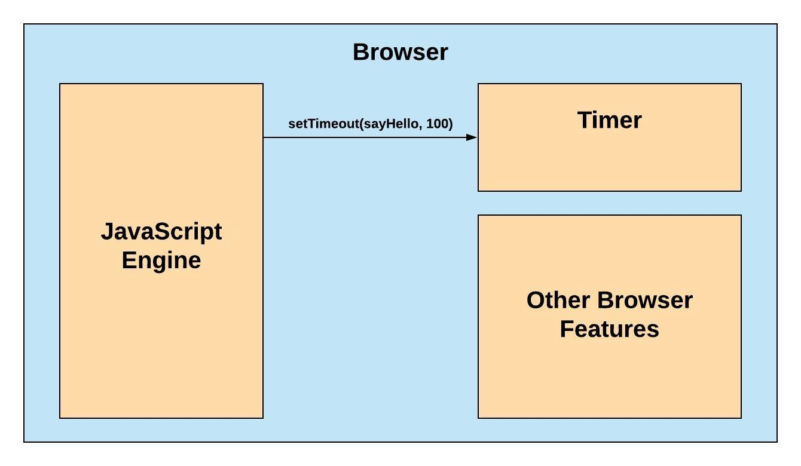
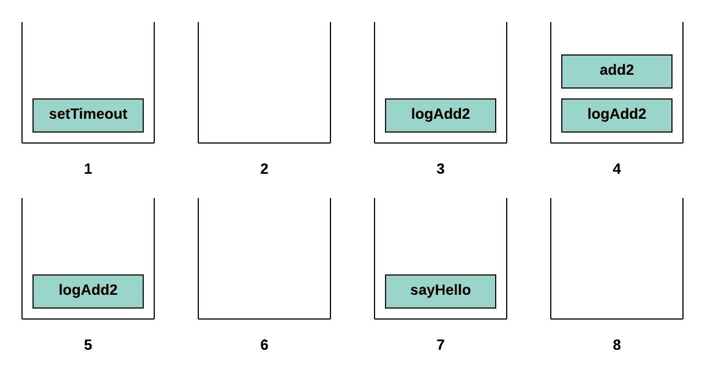
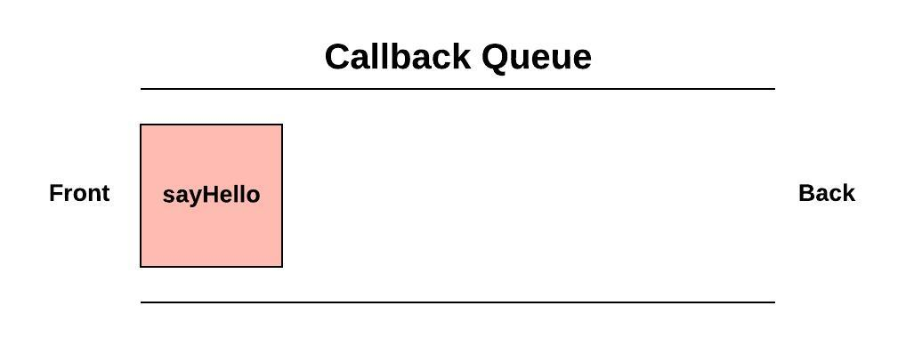

JavaScript is single threaded which means that it can only do one thing at a time. This feature is beneficial as it helps developers reason about their codebase and you don't have to worry about managing data across multiple threads.

**But if JavaScript can only do one thing at a time, how does it handle asynchronous operations?**

Consider this example. When will the last `console.log` run?

```js
function sayHello() {
	console.log('Hello');
}

function blockForOneSec() {
	// Imagine a really long loop
}

setTimeout(sayHello, 100);

console.log('I am first');
blockForOneSec();
console.log('When will I run?');
```

Understanding the event loop will make working through asynchronous code and the bugs they produce much easier to reason about.

Before we dive into that we need to understand what happens when we call an asynchronous function and how the JavaScript interpreter keeps track of what code it is currently running.

### Web APIs

Lets look at this example:


```js
function sayHello() {
	console.log('Hello');
}

setTimeout(sayHello, 100);
console.log('I am first');
```

Using [`setTimeout`](https://developer.mozilla.org/en-US/docs/Web/API/WindowOrWorkerGlobalScope/setTimeout) we delay the execution of `sayHello` for 100ms in the meantime we call `console.log`. Here's what we expect to see in the console:

```
I am first
// ~100ms passes
Hello
```

Lets pull back the curtain on what is actually going on in this example.

Web browsers are incredibly powerful applications that do more than interpret JavaScript applications. They render a DOM tree, make HTTP requests, interpret CSS, and much more. Browsers expose a JavaScript API for these features. This means that we can communicate and use all the tools that a browser provides with one high-level language. 

Each browser has a JavaScript engine that handles the execution of JavaScript code. When you call an asynchronous function with JavaScript what you're really doing is telling the browser to do the work and then get back to you once it finishes. `setTimeout` is an example of one of these functions. You are telling the browser's built in timer to call a JavaScript function after a specific amount of time has passed.



After JavaScript is done delegating that task to the browser it can continue on to the next line and calls `console.log` which is why *"I am first"* comes first in the console.

Once the allotted time (100ms) has passed, the browser calls that function that was passed to it and we see *"Hello"* in the console.

When an asynchronous function is called JavaScript delegates the task to the browser and gives it a callback function. When the work is complete, the browser calls the callback and the function takes care of the rest.

### The Call Stack

The Call Stack is how the JavaScript interpreter keeps track of what function is currently executing. 

Let's look at an example:

```js
function sayHello() {
	console.log('Hello');
}

function logAdd2(data) {
	console.log(add2(data));
}

function add2(n) {
	return n + 2;
}

setTimeout(sayHello, 500);
logAdd2(5);
```



1. `setTimeout` delegates to the browser to call sayHello function back once 500ms has passed. While we delegate to the browser setTimeout is pushed on the call stack.

2. After returning setTimeout is then popped off the stack.

3. When logAdd2 is called it is added to the stack.

4. Inside of logAdd2's body a call to add2 is made so add2 is pushed to the stack on top of logAdd2.

5. After add2 returns a value it is popped off the stack leaving logAdd2 left.

6. After logAdd2 returns it too is popped off the stack. Since there is no other synchronous code to execute the call stack is empty. 

7. Approximately 500ms later the browser pushes sayHello onto the stack and we run the code in its body.

8. Once finished sayHello is popped off the stack.

So when we delegate asynchronous tasks to the browser they don't stay on the Call Stack, this is what lets JavaScript keep moving on to the rest of the code while we wait for the task to finish. When the asynchronous task is complete the browser handles adding it back to the stack for us.


However there is one problem with this solution. What happens when an asynchronous task finishes while we still have functions on the Call Stack?

```js
function sayHello() {
	console.log('Hello');
}

function blockForOneSec() {
	// Imagine a really long loop
}

setTimeout(sayHello, 100);

console.log('I am first');
blockForOneSec();
```

When 100ms passes we will still be executing the code inside `blockForOneSec`. We can't call the callback function yet while the single thread is blocked already. So what do we do?

### The Callback Queue

Luckily browser designers and developers have already figured out this problem for us. When an asynchronous task is finished the browser does not automatically call the function passed to it. Instead, it pushes it into a dedicated space called the *Callback Queue*.



When the thread is no longer blocked we are free to call the callback function. If we execute the previous code snippet we will see this in the console:

```
I am first
// One whole second passes
Hello
```

Even though the timer finished the task after 100ms it waited in the Callback Queue for an additional 900ms while we were still running `blockForOneSec`. Once all of the synchronous code finished running the single thread was unblocked and we are able to call the callback function waiting in the Callback Queue.

If while we were waiting another asynchronous task finished, maybe another timer or an HTTP response comes back, the callback associated would be added behind the first callback. 

So now we have a systematic way to determine when asynchronous tasks are operated. 

You might be wondering by now, **Where does the event loop come in then?**

### The Event Loop

The Event Loop is what checks the Call Stack to make sure its empty, if it is then it takes the next function waiting in the CallBack Queue and pushes it on the stack.

It is similar to any other loop that continuously checks for a condition before executing a task. 

Let's look at that example from the beginning again and work through it.

```js
function sayHello() {
	console.log('Hello');
}

function blockForOneSec() {
	// Imagine a really long loop
}

setTimeout(sayHello, 100);

console.log('I am first');
blockForOneSec();
console.log('When will I run?');
```

First setTimeout is called and we delegate to the browser to queue sayHello after 100ms.

After it is delegated we move on and call console.log then we call blockForOneSec.

While executing blockForOneSec the timer finishes and pushes sayHello into the Callback Queue. The event loop sees that the Call Stack is not empty yet since we are still running blockForOneSec.

Approximately 900ms later blockForOneSec finishes and is popped off the Call Stack. 

Now the Event Loop is still checking the Call Stack and there aren't any functions on it at this exact moment in time, but it is still not empty. The initial execution context is still there. Without going into the weeds, the execution context the environment where we execute the functions.

In short all of the synchronous code will be executed before any asynchronous callback is called.

So we move on and call the next console.log which pushes it on the stack. sayHello is still waiting in the CallBack Queue.

Once console.log has finished running and pops off the call stack all of the synchronous code has finished, the Call Stack is now empty. The event loop that has been checking the stack finally is able to push sayHello onto the call stack.

The final console output looks like this: 

```
I am first
// 1 whole second passes
When will I run?
Hello
```
